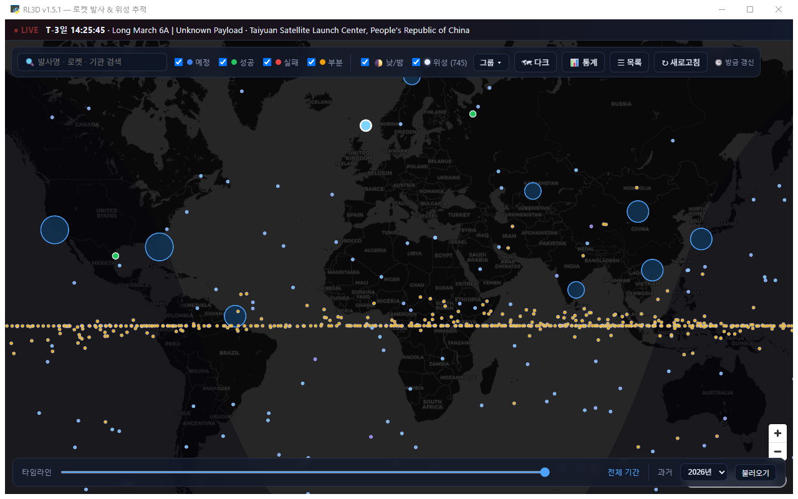

# RL3D — 로켓 발사 & 위성 추적

**v1.5.1** · [변경 이력](CHANGELOG.md)

전 세계 로켓 발사를 **2D 지도**에 표시하고, 위성을 실시간으로 움직이게 보여주는 Windows 데스크톱 앱.
뉴스 상황판 감성의 다크 테마. pywebview + MapLibre GL 로 만든 단일 exe(설치 불필요).



> 위 화면(v1.5.1): 발사장 마커(클러스터), 위성 745개의 실시간 위치(stations+visual+GEO — 적도를 따라
> 늘어선 주황 점이 정지궤도 벨트), 낮/밤 오버레이, 다음 발사까지 카운트다운하는 상단 속보 티커, 하단 타임라인.

## 기능

- 🗺 **발사 지도** — 전 세계 발사장을 마커로 표시 (🔵예정 / 🟢성공 / 🔴실패 / 🟠부분실패)
- 📋 **상세 패널** — 마커 클릭 시 로켓·기관·미션·궤도·발사 시각·이미지·미션 설명. **실패/지연 시 그 사유도 표시**. 범주형 정보는 한국어로 표시
- ▶ **중계 링크 · 발사 소식** — 발사별 유튜브/X 중계를 버튼 하나로 열고(기본 브라우저), 생중계 중이면 배지 표시.
  지연·재조정·리프트오프 같은 소식 타임라인과 미션 패치·프로그램 태그·발사 윈도우·"이 발사대 N번째" 기록까지
- 🛰 **위성 상세** — 위성 클릭 시 고도·속도·궤도 주기·경사각·이심률을 실시간 갱신(넓은 클릭 영역으로 움직이는 점도 쉽게 선택)
- 📡 **속보 티커** — 임박한 예정 발사 카운트다운과 **최근 발사 결과**(성공/실패 배지 + "N시간 전")를 섞어 순환
- 🔍 **검색 / 필터** — 발사명·로켓·기관 검색, 결과별 on/off
- ☰ **목록 사이드바 (발사 / 위성 / 관심 탭)** — 발사 탭은 필터·검색·타임라인이 적용된 목록, 위성 탭은 이름·NORAD 검색.
  행 클릭 시 해당 위치로 이동 + 상세 패널
- 🛫 **관점 화면 (발사장 · 기관 · 로켓)** — 상세 패널의 발사장·기관·로켓 이름을 클릭하면 그 대상만의 총 발사·성공률과
  구성 막대(발사장은 로켓·기관·패드별, 기관/로켓은 로켓·발사장·연도별) + 예정/최근 발사 목록
- ⭐ **관심 발사 · 위성** — 상세 패널의 `☆ 관심`으로 담아두면 지도에서 금색으로 강조되고 사이드바 **⭐ 관심** 탭에 모인다. 다음 실행에도 유지
- 🗺 **배경 지도 전환** — 다크(CARTO) ↔ 위성사진(Esri). 툴바에서 전환, 설정에 저장
- 🗄 **과거 발사 아카이브** — 타임라인 옆에서 연도(최근 5년) 선택 후 불러오면 그 해 발사가 지도·목록·타임라인에 추가됨. 지난 연도는 영구 캐시(재요청 없음)
- 📊 **발사 통계** — 총 발사·성공률·예정 요약 + 결과별/연도별/기관/국가 막대(불러온 데이터 기준, 아카이브를 불러올수록 정확)
- 🛰 **위성 그룹 선택** — stations·visual·Starlink·GPS·Galileo·기상·과학·GEO 토글.
  Starlink만 2,000개 상한(전체 10,000여 개를 거듭 받으면 Celestrak이 요청을 막는다), 나머지는 전부 표시
- 🛰 **궤도 대역 필터** — 툴바 `그룹 ▾` 안에서 저궤도(LEO)·중궤도(MEO)·정지궤도(GEO)를 켜고 끈다.
  이미 받아둔 TLE만 걸러내므로 재요청 없이 즉시 반영되고, 툴바에 `(보이는 수/전체)`로 표시된다(관심 위성은 필터와 무관하게 남는다)
- 🕒 **갱신 시각 표시 / 설정 저장** — "N분 전 갱신" 상시 표시. 필터·토글·위성 그룹·궤도 대역·관측 위치·관심 목록·지도 위치·창 위치/크기를 저장해 다음 실행에 복원
- 🔄 **자동 갱신** — 5분마다 백그라운드 폴링, 새 발사·상태 변화(예정→성공 등)를 화면 하단에 표시
- 🛰 **위성 레이어(선택)** — Celestrak TLE + satellite.js(SGP4)로 위성 실시간 위치. **기본 OFF**, 툴바에서 켜기.
  점 색이 궤도 대역을 나타낸다(저궤도 하늘색 → 중궤도 보라 → GPS 대역 분홍 → 정지궤도 주황)
- 🛰 **지상궤적선 · 추적 모드** — 위성 클릭 시 약 1주기의 지상궤적선을 표시, "추적" 버튼으로 지도 중심을 위성에 고정(지도를 직접 드래그하면 해제)
- 🌓 **낮/밤 오버레이** — 현재 태양 위치로 야간 반구를 음영 처리(외부 데이터 없이 계산, 분 단위 갱신). 툴바에서 켜고 끄기, 기본 ON
- 📍 **통과 예측** — 지도 클릭으로 관측 위치 지정 → 선택한 위성의 향후 24시간 통과(시각·방위·최대고도)를 계산. 외부 API 없이 satellite.js로 계산, 관측 위치는 저장됨

## 실행

```powershell
# 개발 실행
python main.py

# exe 빌드 → dist\RL3D.exe
build.bat
```

의존성: `pip install -r requirements.txt` (pywebview, pyinstaller, pythonnet[win]). Python 3.10+ 권장.

### 개발 테스트 (2번 모니터)
```powershell
RL3D_DEV_MONITOR=2 python main.py   # 창을 2번(보조) 모니터에 배치
```
`RL3D_DEV_MONITOR` 환경변수는 개발 테스트용이며 배포 exe 에는 영향이 없다.

## 데이터 소스

| 데이터 | 출처 | 캐시 TTL |
|---|---|---|
| 발사 | [Launch Library 2](https://thespacedevs.com/llapi) (thespacedevs) | 15분 |
| 과거 발사 아카이브 | Launch Library 2 (연도별) | 지난 연도 영구 · 올해 6시간 |
| 위성 TLE | [Celestrak](https://celestrak.org/) (그룹 선택: stations/visual/starlink/gps 등) | 2시간 |

- 캐시 위치: `%APPDATA%\RL3D\cache\` (`launches.json`, `tle_<그룹>.json`, `archive_<연도>.json`)
- 설정 위치: `%APPDATA%\RL3D\settings.json` (필터·토글·위성 그룹·관측 위치·창 상태)
- LL2 는 **시간당 약 15회** 제한 → 캐싱 우선. API 실패 시 오래된 캐시라도 반환(오프라인 대응)
- **새로고침 버튼**: 캐시 무시 강제 갱신 (요청 제한 주의)

## ⚠ 온라인/오프라인

- MapLibre GL·satellite.js 라이브러리는 exe 안에 **오프라인 번들**(`web/lib/`)로 포함
- 단 **지도 배경 타일(CARTO dark · Esri World Imagery)과 발사/위성 데이터는 인터넷 연결이 필요**하다
- 오프라인이면 발사·위성은 저장된 캐시로 그대로 뜨고 **배경 지도만 비어 보인다** → 이때 지도 좌하단에
  안내 배지가 나타난다(눌러서 닫을 수 있고, 연결이 돌아와 타일이 받아지면 스스로 사라진다)
- 완전 오프라인(지도 배경까지)은 현재 범위 밖 — 로컬 타일 번들은 향후 과제

## 터미널 스모크 / 테스트

```powershell
python api_client.py            # 데이터 소스별 [OK]/[FAIL]·건수 확인 (GUI 없이, 네트워크 필요)
python tests/test_parsing.py    # 파이썬 정규화 회귀 테스트 (픽스처 기반, 네트워크 불필요)
node tests/test_frontend.js     # 프론트엔드 회귀 테스트 (브라우저·네트워크 불필요)
```

파싱 회귀 테스트는 `tests/fixtures/`에 저장한 **실제 API 응답**을 파싱해 `tests/golden/`의 기대 결과와 비교한다.
외부 API가 필드를 바꾸거나 파싱을 잘못 건드리면 여기서 잡힌다.

프론트엔드 테스트는 `web/js/*.js`를 로드 순서대로 이어 붙여 Node `vm`에 스텁 DOM과 함께 올리고
함수를 직접 호출한다(마우스 자동화 없음).
궤도 대역 분류·필터, 설정 복원 방어, 오프라인 판정, 이스케이프, 통계 집계처럼 **깨져도 화면상으로는
알아채기 어려운** 로직이 대상이다. 로딩·스텁은 `tests/harness.js` 한 곳에 있다.

```powershell
python tests/capture_fixtures.py     # 픽스처 새로 받기(네트워크·LL2 요청 소모)
python tests/test_parsing.py --update # 골든 갱신(픽스처를 새로 받은 뒤에만)
```

## 요구 사항

- Windows 10/11 — WebView2 런타임 필요(대부분 기본 내장). 흰 화면이 뜨면 WebView2 Runtime 설치

## 실시간 발사 텔레메트리에 대하여

발사 순간의 실시간 고도/속도 텔레메트리를 제공하는 **무료 공개 API는 사실상 없다**(SpaceX 등도 웹캐스트 영상뿐).
본 앱의 "실시간"은 **발사 일정·상태의 자동 갱신**(위 자동 갱신 기능)으로 구현했다. 과거 발사 텔레메트리 기록은
[Launch-Dashboard-API](https://github.com/shahar603/Launch-Dashboard-API) 같은 오픈소스가 있으나 라이브가 아니다.

## 라이선스

[MIT](LICENSE)

번들된 서드파티 라이브러리는 각자의 라이선스를 따른다 — MapLibre GL JS(BSD-3-Clause), satellite.js(MIT).
발사/위성 데이터는 각 제공처(thespacedevs, Celestrak)의 이용 조건을 따른다.

## 파일 구조

```
RL3D/
├── main.py          pywebview 창 + Api 브릿지
├── api_client.py    LL2 발사 + Celestrak TLE 호출·정규화·캐싱
├── build.bat        exe 빌드
├── requirements.txt
├── tests/           파싱 회귀 테스트 + 픽스처/골든, 프론트 회귀 테스트
└── web/
    ├── index.html · style.css
    ├── js/          state · utils · map · launches · sats · panels · settings · boot
    │                (클래식 스크립트 — index.html 의 로드 순서가 곧 의존 관계)
    └── lib/         maplibre-gl(.js/.css), satellite.min.js (오프라인 번들)
```
